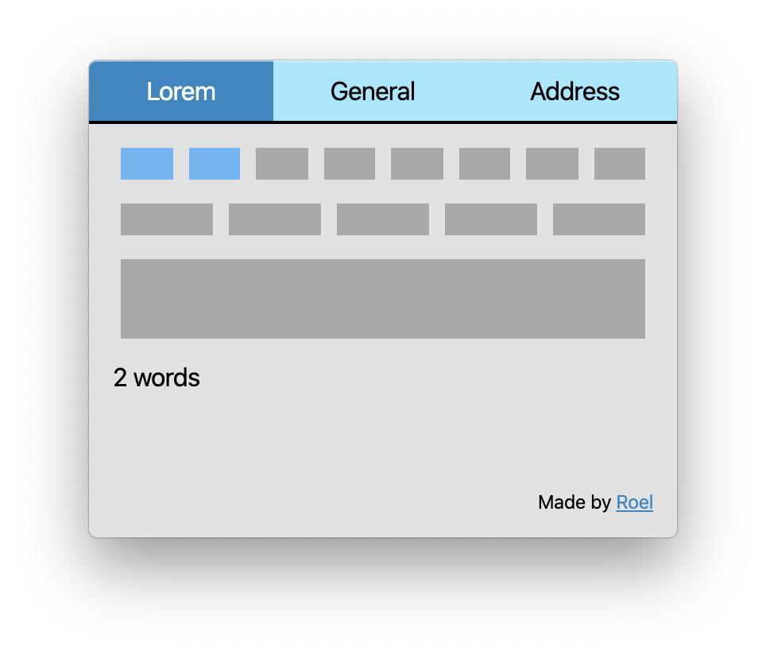
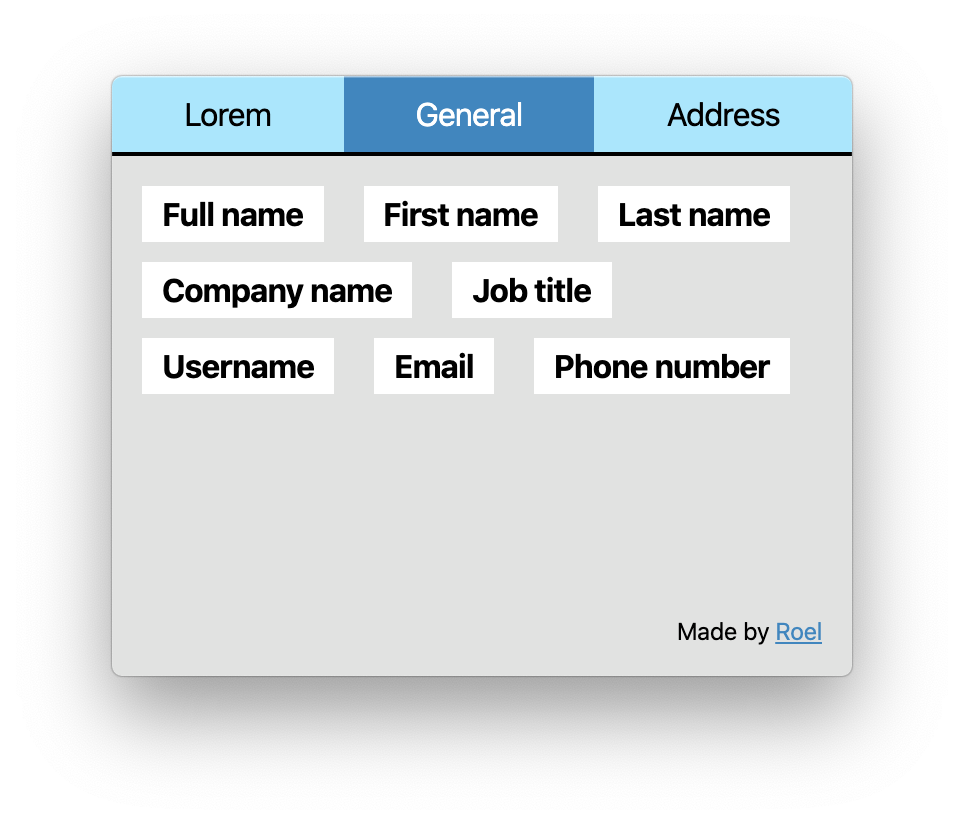

# Lorem Fakersum
## A menubar app to generate lorem ipsum text or fake data. Just open the app, click on the data you need and it's copied!




Check the `Releases` for the latest version of the Mac app. Because I don't have an Apple Developer account, I can't sign the app with a valid certificate so you get this notice:


__To fix this:__
- Click on Cancel
- Go to your System Preferences and Security & Privacy
- On the General tab click on 'Open Anyway' and the app should appear in the menubar!

## Install & Use

To clone and run this repository you'll need [Git](https://git-scm.com) and [Node.js](https://nodejs.org/en/download/) (which comes with [npm](http://npmjs.com)) installed on your computer. From your command line:

```bash
# Install dependencies
npm install
# Run the app
npm start
```

```bash
# Watch asset changes
npm run watch
```

## Build the application

[Electron Packager](https://github.com/electron/electron-packager) is used to build the application.

The next part assumes you use macOSS. At this moment Windows and Linux are untested.

To build the app, run the following command in the directory:
```
electron-packager . --icon=icon.icns
```

This will do the following:
- Use the current directory for the sourcedir
- Infer the appname from the productName in package.json
- Infer the appVersion from the version in package.json
- Infer the platform and arch from the host, in this example, darwin platform and x64 arch.
- Download the darwin x64 build of Electron 1.4.15 (and cache the downloads in ~/.electron)
- Build the macOS Lorem Fakersum.app
- Place Lorem Fakersum.app in foobar/Lorem Fakersum-darwin-x64/ (since an out directory was not specified, it used the current working directory)

## Thanks
Thanks to [Faker.js](https://github.com/marak/Faker.js/) for making an awesome library.